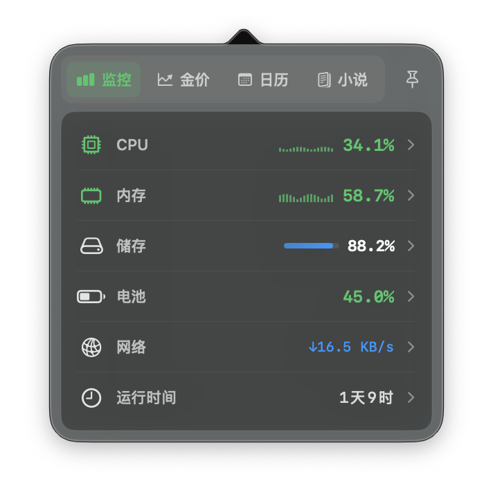
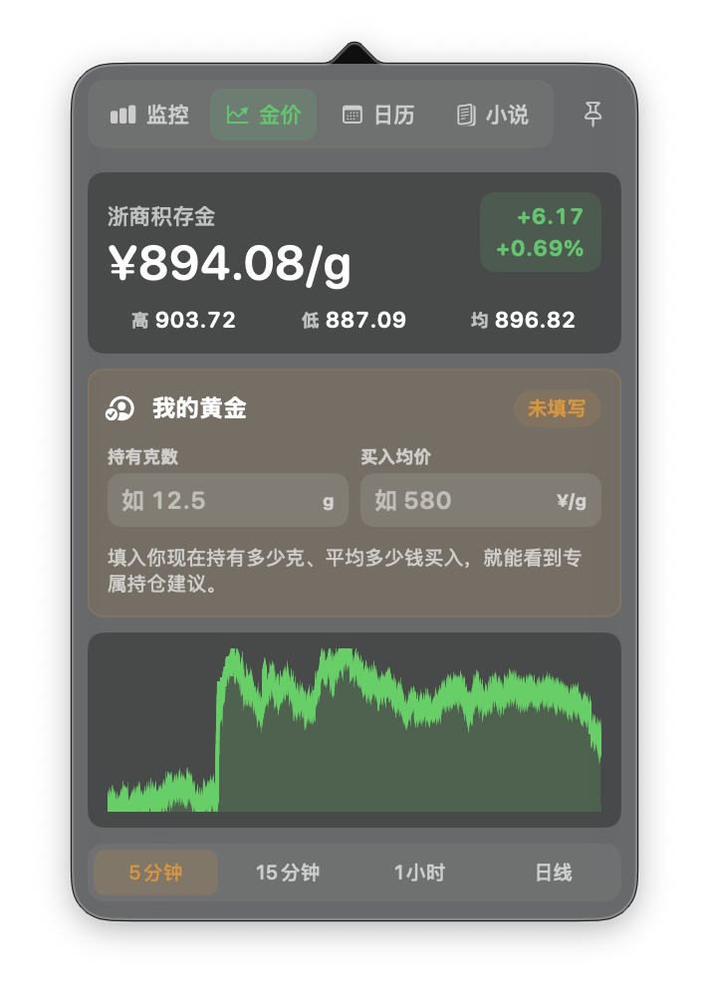
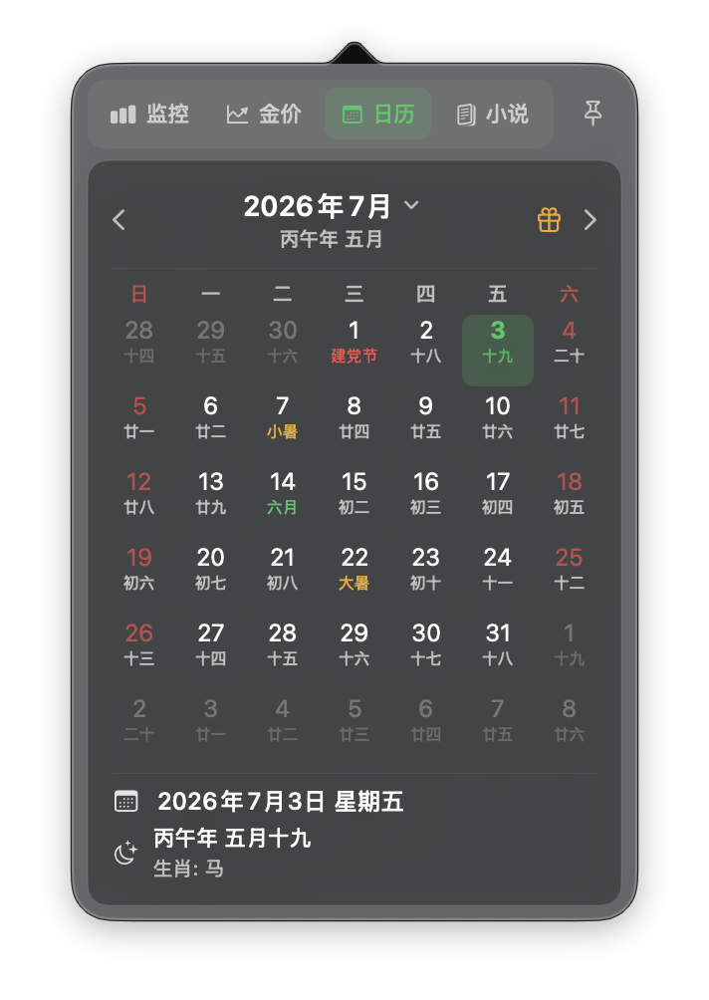
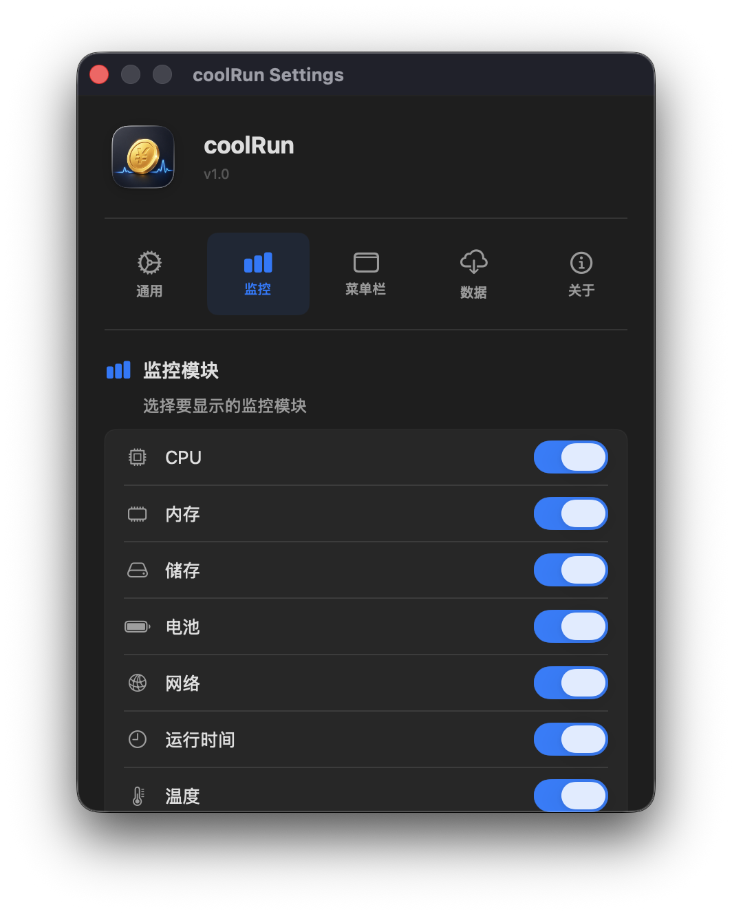

# GoldRun

[](https://github.com/kuaoaoaoao/GoldRun/actions/workflows/build-macos.yml)
[](LICENSE)

GoldRun 是一款原生 macOS 菜单栏效率工具，把系统监控、实时金价、日历倒数日、英语学习和 AI 额度放进一个轻量悬浮窗。

它默认常驻菜单栏，不占 Dock。菜单栏可以显示金价、日期、系统状态、英语内容、最近倒数日或 Codex/Claude 剩余额度；点击后打开悬浮面板。悬浮窗支持固定，适合边工作边查看信息或学习英语。


官网：[kuaoaoaoao.github.io/GoldRun](https://kuaoaoaoao.github.io/GoldRun/)

下载：[GitHub Releases](https://github.com/kuaoaoaoao/GoldRun/releases)

## GitHub Star History

[](https://star-history.com/#kuaoaoaoao/GoldRun&Date)

## 当前重点功能

- 新增 Codex / Claude 额度总览：展示最紧张的额度窗口、剩余比例、重置时间和使用节奏。
- 新增倒数日：支持公历、农历、闰月、一次性和每年重复，并与日历选中日期联动。
- 新增英语学习：内置分级词汇、句子、短文、复习进度、系统语音和可选 Kokoro TTS。
- 金价模块从“看价格”升级为“看分析”：记录历史价格，展示折线图、K 线、RSI、MACD、均线、波动率、买卖倾向和新手解释。
- 新增高级策略分析：市场状态识别、均值回归、蒙特卡洛模拟、网格区间、风险仓位和更直白的新手建议。
- 新增个人持仓建议：输入持有克数和买入均价后，自动计算成本、现值、浮盈浮亏，并按亏损/盈利状态给出分批补仓、观望、继续持有或部分止盈建议。
- 菜单栏悬浮窗支持图钉固定，固定后不会因为点击其他位置而自动关闭。
- 数据备份可迁移生日、倒数日、英语进度、金价记录与持仓和应用设置。

## 适合你如果

- 你想把金价固定在 macOS 菜单栏里，随手看一眼。
- 你想知道 Mac 当前是不是高负载、内存是否紧张、温度是否偏高。
- 你想要一个小白也能看懂的金价分析面板，而不只是技术指标。
- 你同时使用 Codex 或 Claude Code，希望随手查看额度和重置时间。
- 你想把考试、纪念日等公历或农历日期固定在菜单栏。
- 你喜欢小巧、原生、不会占 Dock 的菜单栏工具。
- 你想参考一个 SwiftUI + AppKit 的 macOS 菜单栏应用实现。

## 功能特性

### 菜单栏常驻

- 不占用 Dock，不打断当前工作。
- 菜单栏可显示实时金价、日期、CPU、内存、实时网速、英语内容、AI 额度或最近倒数日。
- 金币图标根据 CPU 占用动态加速，负载越高动作越快。
- 支持经典翻面、招财弹跳、抛金币、金币滚动和金光闪闪 5 种动作。
- 支持人民币金币、招财福币、上涨金币、方孔古钱和星光金币 5 种外观。
- 动画流畅度可以关闭，或选择节能与流畅档位。
- 左键打开悬浮面板，右键打开快捷菜单。
- 悬浮面板支持固定，固定后可以停在屏幕上继续操作其他应用。

### 系统监控

- CPU：核心数、实时占用、动态占用条、趋势图、健康状态颜色。
- 内存：已用内存、总内存、内存压力、趋势图。
- 储存：已用空间、可用空间、使用进度。
- 电池：电量、充电状态、健康度、循环次数、温度、功率和预计充放电时间。
- 网络：连接状态、本地 IP、活动接口数量、上传/下载速度。
- 温度：CPU 和 GPU 温度，通过 SMC 传感器读取。
- 运行时间：系统已运行时长。
- 进程：按 CPU 或内存排序，可合并同名进程，并在确认后结束进程。
- 点击指标可复制到剪贴板。

### 金价分析

- 查询浙商银行积存金价格，人民币/克展示。
- 自动记录历史价格，生成最近走势。
- 支持折线图、迷你 K 线、周期切换。
- 技术指标：RSI、MACD、SMA20、波动率、支撑位、压力位。
- 交易信号：偏多、偏空、观望，以及入场、止损、止盈参考。
- 新手结论：用“可小额分批观察”“观望为主”“暂不建议买入”“不建议追买”等直白语言解释行情。
- 术语解释：把 RSI、MACD、均值回归、网格、建议仓位、买入均价、浮盈浮亏等概念写成普通人能看懂的话。

### 个人持仓建议

- 输入当前持有黄金克数和买入均价。
- 自动计算成本、市值、浮盈/浮亏和收益率。
- 亏损时根据行情强弱提示是否分批补仓、如何降低均价、什么时候先观望。
- 盈利时提示继续持有、设置保本线或部分卖出锁定利润。
- 输入内容会保存在本机，下次打开仍然可见。

> 金价分析仅用于信息展示和个人记录，不构成投资建议。黄金价格可能波动，任何买卖都需要自行判断风险。

### 日历与生日

- 菜单栏面板内置日历视图。
- 支持农历显示、节假日/调休标记。
- 支持生日管理和选中日期详情。
- 支持公历/农历倒数日，并可直接为选中日期创建事件。
- 菜单栏也可切换为日期显示模式。

### AI 额度

- 统一展示 Codex 与 Claude Code 用量状态。
- 自动选择剩余最少的额度窗口作为总览重点。
- 展示剩余比例、预计重置时间和当前使用节奏。
- Codex 可查看近期本地任务；Claude 使用本机 Claude Code 登录凭据读取官方 usage 接口。
- 只在 AI 面板可见时刷新，避免后台空转和接口限频。
- 额度提醒默认关闭，用户主动开启后才请求通知权限。

### 英语学习

- 内置日常、小学、初中、高中、CET、IELTS、TOEFL 等词汇内容。
- 支持单词、句子、短文与每日内容。
- 记录学习次数、掌握程度、收藏、待复习项目和连续学习天数。
- 使用 macOS 系统语音朗读；高级用户可配置本机 Kokoro TTS。

### 设置与更新

- 多语言：简体中文、English、日本語、한국어。
- 可选择菜单栏显示金价、日期、CPU、内存或实时网速。
- 支持登录 Mac 时自动启动。
- 可分别调整金币外观、动作、动画流畅度、系统采样和金价更新频率。
- 匿名使用数据统计默认关闭；未配置分析令牌的开源构建无法开启。
- 可开关各个系统监控模块。
- 支持本地备份和兼容旧版本的合并导入。
- 设置页可打开 GitHub 项目主页和 Releases。

## 界面预览

<table>
  <tr>
    <td align="center">
      
      <br>
      <sub>菜单栏悬浮窗</sub>
    </td>
    <td align="center">
      
      <br>
      <sub>菜单栏金价</sub>
    </td>
  </tr>
  <tr>
    <td align="center">
      
      <br>
      <sub>金价分析</sub>
    </td>
    <td align="center">
      
      <br>
      <sub>深色主界面</sub>
    </td>
  </tr>
  <tr>
    <td align="center">
      
      <br>
      <sub>日历</sub>
    </td>
    <td align="center">
      
      <br>
      <sub>设置页面</sub>
    </td>
  </tr>
</table>

## 安装方式

### 从 GitHub Releases 安装

1. 打开 [GitHub Releases](https://github.com/kuaoaoaoao/GoldRun/releases)。
2. 下载最新的 `GoldRun.dmg`，双击打开。
3. 将 `GoldRun.app` 拖入 `Applications` 文件夹。
4. 启动后，在 macOS 菜单栏找到金币图标。

> 当前安装包未经 Apple 公证。若首次启动被 macOS 拦截，请打开“系统设置 → 隐私与安全性”，在安全性区域选择“仍要打开”。请只从本项目的 GitHub Releases 下载。

## 使用方式

- 左键点击菜单栏金币图标：打开或关闭悬浮面板。
- 点击图钉按钮：固定或取消固定悬浮面板。
- 固定后可一边使用其他应用，一边查看数据或学习英语。
- 右键点击菜单栏金币图标：打开快捷菜单。
- 快捷菜单中的“设置”：打开设置页面。
- 快捷菜单中的“退出程序”：退出 GoldRun。

## 从源码运行

### 环境要求

- macOS 15 或更高版本
- Xcode 16.4 或更高版本，建议使用最新稳定版
- Swift Package Manager（Xcode 内置）

### 运行项目

1. 克隆项目：

   ```bash
   git clone https://github.com/kuaoaoaoao/GoldRun.git
   cd coolRun
   ```

2. 使用 Xcode 打开：

   ```bash
   open coolRun.xcodeproj
   ```

3. 选择 `coolRun` scheme。
4. 运行目标选择 `My Mac`。
5. 点击运行。

### 运行测试

```bash
DEVELOPER_DIR=/Applications/Xcode.app/Contents/Developer \
xcodebuild \
  -project coolRun.xcodeproj \
  -scheme coolRun \
  -configuration Debug \
  -destination 'platform=macOS' \
  -derivedDataPath /tmp/coolRun-derived \
  CODE_SIGNING_ALLOWED=NO \
  test
```

匿名统计不参与测试。fork 或本地构建默认不配置 PostHog；维护者配置方式见 [CONTRIBUTING.md](CONTRIBUTING.md)。

## 平台状态

- `GoldRun`：主要维护的 macOS SwiftUI + AppKit 应用；内部 Xcode target 和 scheme 暂时保留为 `coolRun`。
- `GoldRun Watch`：watchOS 辅助目标，功能范围较小。
- `coolrun-windows`：Tauri 实验版，不保证与 macOS 功能一致。
- `coolrun-avalonia`：Avalonia 技术验证版本，不保证功能一致。

## 打包发布

仓库的 `Package unsigned macOS build` Action 可以在不配置 Apple 账号的情况下生成 `GoldRun.dmg`。它会先运行 Release 构建，再应用 ad hoc 临时签名并验证 App Bundle。该签名不能代替 Developer ID 或 Apple 公证。Action 生成的文件默认保留 30 天，发布者核对后可手动上传到 GitHub Release。

### 制作 DMG

项目提供了 DMG 打包脚本：

```bash
./scripts/create-dmg.sh
```

也可以手动指定 app 路径：

```bash
./scripts/create-dmg.sh /path/to/GoldRun.app
```

DMG 不会自动获得 Developer ID 签名或公证，公开发布时需要明确说明。

脚本会在项目根目录生成 `GoldRun.dmg`。

## 金价数据说明

当前行情与市场背景来自多个公开接口：

```text
ms.jr.jd.com
api.jdjygold.com
gold.rsky.cn
hq.sinajs.cn
news.google.com
home.treasury.gov
```

接口均由第三方提供，稳定性和数据准确性取决于服务方。部分数据不可用时，应用会使用缓存或降低分析完整度。GoldRun 仅展示接口数据和基于历史样本的规则分析，不构成投资建议。

## 项目结构

```text
coolRun
├── coolRun.xcodeproj
├── coolRun
│   ├── coolRunApp.swift
│   ├── MacAppDelegate.swift
│   ├── ContentView.swift
│   ├── MenuBarMonitorView.swift
│   ├── SettingsView.swift
│   ├── GoldPriceService.swift
│   ├── GoldPriceStore.swift
│   ├── GoldAnalysisView.swift
│   ├── GoldAnalysisEngine.swift
│   ├── GoldAdvancedStrategy.swift
│   ├── GoldPositionAdvisor.swift
│   ├── GoldTradeStore.swift
│   ├── CalendarView.swift
│   ├── CountdownModel.swift
│   ├── CodexMonitor.swift
│   ├── ClaudeMonitor.swift
│   ├── EnglishLearningManager.swift
│   ├── SystemMonitorViewModel.swift
│   ├── SystemSampler.swift
│   ├── SystemMetrics.swift
│   ├── AppVersion.swift
│   ├── coolRun.entitlements
│   └── Assets.xcassets
├── docs
│   └── index.html
├── scripts
│   └── create-dmg.sh
├── coolRunTests
├── CONTRIBUTING.md
├── PRIVACY.md
├── SECURITY.md
├── README.md
└── LICENSE
```

主要文件说明：

- `MacAppDelegate.swift`：菜单栏图标、金币动画、悬浮窗、固定逻辑、右键菜单和金价刷新。
- `ContentView.swift`：主面板视图模式、系统监控面板和公共 UI 组件。
- `MenuBarMonitorView.swift`：菜单栏悬浮面板。
- `GoldAnalysisView.swift`：金价分析 UI。
- `GoldAnalysisEngine.swift`：基础统计、技术指标快照和交易信号。
- `GoldAdvancedStrategy.swift`：高级量化策略分析。
- `GoldPositionAdvisor.swift`：个人持仓盈亏和建议。
- `CalendarView.swift`：日历、农历、节假日和生日入口。
- `CountdownModel.swift`：公历/农历倒数日和日期匹配。
- `CodexMonitor.swift`、`ClaudeMonitor.swift`：本机 AI 客户端额度与任务状态。
- `EnglishLearningManager.swift`：英语内容队列、学习进度和语音流程。
- `SettingsView.swift`：设置页面。
- `scripts/create-dmg.sh`：DMG 打包脚本。

## 隐私说明

系统监控、生日、倒数日、学习进度和持仓默认只保存在本机。匿名统计默认关闭，AI 凭据不会进入备份或统计。完整的数据保存位置、网络目标和统计事件范围见 [PRIVACY.md](PRIVACY.md)。

## 贡献

欢迎提交 Issue 和 Pull Request。开始前请阅读 [CONTRIBUTING.md](CONTRIBUTING.md)；涉及凭据或隐私泄露的问题请按 [SECURITY.md](SECURITY.md) 私下报告。

可以改进的方向：

- 更多贵金属或自定义数据源。
- 更完整的金价分析回测。
- 更完善的多平台功能对齐。

## 许可证

本项目基于 MIT License 开源，详见 [LICENSE](./LICENSE)。

## 作者

- 作者：kuaoaoaoao
- GitHub：[github.com/kuaoaoaoao/GoldRun](https://github.com/kuaoaoaoao/GoldRun)
