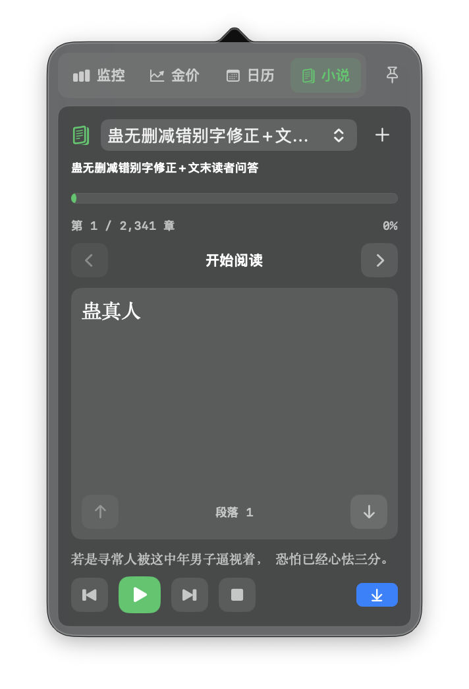

# coolRun

coolRun 是一款 macOS 菜单栏工具，把实时金价、Mac 状态、日历生日和小说阅读放进一个轻量悬浮窗里。

它默认常驻菜单栏，不占 Dock。菜单栏可以显示浙商银行积存金价格或日期；点击后打开悬浮面板，查看系统监控、金价分析、日历和小说。悬浮窗支持固定，适合一边工作一边看小说或听语音朗读。


官网：[kuaoaoaoao.github.io/coolRun](https://kuaoaoaoao.github.io/coolRun/)

下载：[GitHub Releases](https://github.com/kuaoaoaoao/coolRun/releases)

## Star History

[](https://star-history.com/#kuaoaoaoao/coolRun&Date)

## 这次更新做了什么

- 金价模块从“看价格”升级为“看分析”：记录历史价格，展示折线图、K 线、RSI、MACD、均线、波动率、买卖倾向和新手解释。
- 新增高级策略分析：市场状态识别、均值回归、蒙特卡洛模拟、网格区间、风险仓位和更直白的新手建议。
- 新增个人持仓建议：输入持有克数和买入均价后，自动计算成本、现值、浮盈浮亏，并按亏损/盈利状态给出分批补仓、观望、继续持有或部分止盈建议。
- 新增小说阅读模块：支持导入 txt、自动章节解析、阅读进度、书签、主题、滚动/翻页模式。
- 新增语音朗读：使用系统语音合成朗读小说，可暂停、继续、前后句跳转、调节语速、音调、音量和声音。
- 菜单栏悬浮窗新增“小说”入口和图钉固定功能，固定后不会因为点击其他位置而自动关闭，方便悬浮看小说。
- 优化菜单栏面板布局：顶部切换变成四列紧凑入口，减少文字挤压和内容遮挡。

## 适合你如果

- 你想把金价固定在 macOS 菜单栏里，随手看一眼。
- 你想知道 Mac 当前是不是高负载、内存是否紧张、温度是否偏高。
- 你想要一个小白也能看懂的金价分析面板，而不只是技术指标。
- 你想在菜单栏悬浮窗里看 txt 小说，或者用系统语音朗读小说。
- 你喜欢小巧、原生、不会占 Dock 的菜单栏工具。
- 你想参考一个 SwiftUI + AppKit 的 macOS 菜单栏应用实现。

## 功能特性

### 菜单栏常驻

- 不占用 Dock，不打断当前工作。
- 菜单栏可显示实时金价或日期。
- 金币图标根据 CPU 占用动态旋转，负载越高转得越快。
- 左键打开悬浮面板，右键打开快捷菜单。
- 悬浮面板支持固定，固定后可以停在屏幕上继续操作其他应用。

### 系统监控

- CPU：核心数、实时占用、动态占用条、趋势图、健康状态颜色。
- 内存：已用内存、总内存、内存压力、趋势图。
- 储存：已用空间、可用空间、使用进度。
- 电池：电量、充电状态、低电量模式。
- 网络：连接状态、本地 IP、活动接口数量、上传/下载速度。
- 温度：CPU 和 GPU 温度，通过 SMC 传感器读取。
- 运行时间：系统已运行时长。
- 点击指标可复制到剪贴板。

### 金价分析

- 查询浙商银行积存金价格，人民币/克展示。
- 自动记录历史价格，生成最近走势。
- 支持折线图、迷你 K 线、周期切换。
- 技术指标：RSI、MACD、SMA20、波动率、支撑位、压力位。
- 交易信号：偏多、偏空、观望，以及入场、止损、止盈参考。
- 新手结论：用“可小额分批观察”“观望为主”“暂不建议买入”“不建议追买”等直白语言解释行情。
- 术语解释：把 RSI、MACD、均值回归、网格、建议仓位、买入均价、浮盈浮亏等概念写成普通人能看懂的话。

### 个人持仓建议

- 输入当前持有黄金克数和买入均价。
- 自动计算成本、市值、浮盈/浮亏和收益率。
- 亏损时根据行情强弱提示是否分批补仓、如何降低均价、什么时候先观望。
- 盈利时提示继续持有、设置保本线或部分卖出锁定利润。
- 输入内容会保存在本机，下次打开仍然可见。

> 金价分析仅用于信息展示和个人记录，不构成投资建议。黄金价格可能波动，任何买卖都需要自行判断风险。

### 日历与生日

- 菜单栏面板内置日历视图。
- 支持农历显示、节假日/调休标记。
- 支持生日管理和选中日期详情。
- 菜单栏也可切换为日期显示模式。

### 小说阅读

- 支持导入 txt 小说。
- 自动识别章节并保存书库。
- 记住上次阅读章节和段落。
- 支持书签。
- 支持滚动阅读和翻页阅读。
- 支持明亮、暖色、复古、暗夜、水墨主题。
- 可调整字号和行距。
- 独立小说窗口适合完整阅读，菜单栏迷你阅读器适合悬浮阅读。

### 语音朗读

- 使用 macOS 系统语音合成朗读小说。
- 支持播放、暂停、停止、上一句、下一句。
- 支持自动跟随朗读段落。
- 支持语速、音调、音量和语音选择。
- 章节结束后可自动继续朗读下一章。

### 设置与更新

- 多语言：简体中文、English、日本語、한국어。
- 可选择菜单栏显示金价或日期。
- 可开关各个系统监控模块。
- 设置页可打开 GitHub 项目主页和 Releases。

## 界面预览

<table>
  <tr>
    <td align="center">
      
      <br>
      <sub>菜单栏悬浮窗</sub>
    </td>
    <td align="center">
      
      <br>
      <sub>菜单栏金价</sub>
    </td>
  </tr>
  <tr>
    <td align="center">
      
      <br>
      <sub>金价分析</sub>
    </td>
    <td align="center">
      
      <br>
      <sub>小说阅读</sub>
    </td>
  </tr>
  <tr>
    <td align="center">
      
      <br>
      <sub>日历</sub>
    </td>
    <td align="center">
      
      <br>
      <sub>设置页面</sub>
    </td>
  </tr>
</table>

## 安装方式

### 从 GitHub Releases 安装

1. 打开 [GitHub Releases](https://github.com/kuaoaoaoao/coolRun/releases)。
2. 下载最新版本的 `coolRun.dmg` 或 `coolRun.zip`。
3. 如果是 DMG，双击打开后将 `coolRun.app` 拖入 `Applications` 文件夹。
4. 启动 `coolRun`。
5. 启动后在 macOS 菜单栏找到金币图标。

如果 macOS 提示“无法验证开发者”，可以右键点击 `coolRun.app`，选择“打开”，再在弹窗中确认打开。

如果打开 app 时提示“文件已损坏”，这是因为 coolRun 目前未经过 Apple 公证，macOS 会阻止打开。安装后在终端执行：

```bash
sudo xattr -cr /Applications/coolRun.app
```

## 使用方式

- 左键点击菜单栏金币图标：打开或关闭悬浮面板。
- 点击图钉按钮：固定或取消固定悬浮面板。
- 固定后可切到小说页，一边使用其他应用一边看小说或听朗读。
- 右键点击菜单栏金币图标：打开快捷菜单。
- 快捷菜单中的“小说阅读”：打开完整小说书架窗口。
- 快捷菜单中的“设置”：打开设置页面。
- 快捷菜单中的“退出程序”：退出 coolRun。

## 从源码运行

### 环境要求

- macOS
- Xcode
- Swift / SwiftUI

### 运行项目

1. 克隆项目：

   ```bash
   git clone https://github.com/kuaoaoaoao/coolRun.git
   cd coolRun
   ```

2. 使用 Xcode 打开：

   ```bash
   open coolRun.xcodeproj
   ```

3. 选择 `coolRun` scheme。
4. 运行目标选择 `My Mac`。
5. 点击运行。

## 打包发布

### 使用 Xcode 导出 App

1. 使用 Xcode 打开 `coolRun.xcodeproj`。
2. 选择菜单栏：

   ```text
   Product > Archive
   ```

3. Archive 完成后，在 Organizer 中导出 `coolRun.app`。

### 制作 DMG

项目提供了 DMG 打包脚本：

```bash
./scripts/create-dmg.sh
```

也可以手动指定 app 路径：

```bash
./scripts/create-dmg.sh /path/to/coolRun.app
```

脚本会在项目根目录生成 `coolRun.dmg`。

## 金价数据说明

当前金价来源：

```text
https://api.jdjygold.com/gw2/generic/produTools/h5/m/getGoldPrice?goldCode=CZB-JCJ
```

应用会读取接口返回值中的：

```text
resultData.data.lastPrice
```

并展示为：

```text
¥973.24/g
```

金价接口由第三方提供，稳定性和数据准确性取决于接口服务方。coolRun 仅展示接口返回数据和基于历史样本的分析结果，不构成投资建议。

## 项目结构

```text
coolRun
├── coolRun.xcodeproj
├── coolRun
│   ├── coolRunApp.swift
│   ├── MacAppDelegate.swift
│   ├── ContentView.swift
│   ├── MenuBarMonitorView.swift
│   ├── MenuBarNovelReaderView.swift
│   ├── SettingsView.swift
│   ├── GoldPriceService.swift
│   ├── GoldPriceStore.swift
│   ├── GoldAnalysisView.swift
│   ├── GoldAnalysisEngine.swift
│   ├── GoldAdvancedStrategy.swift
│   ├── GoldPositionAdvisor.swift
│   ├── NovelLibraryView.swift
│   ├── NovelReaderView.swift
│   ├── NovelSpeechManager.swift
│   ├── CalendarView.swift
│   ├── SystemMonitorViewModel.swift
│   ├── SystemSampler.swift
│   ├── SystemMetrics.swift
│   ├── AppVersion.swift
│   ├── coolRun.entitlements
│   └── Assets.xcassets
├── docs
│   └── index.html
├── scripts
│   └── create-dmg.sh
├── README.md
└── LICENSE
```

主要文件说明：

- `MacAppDelegate.swift`：菜单栏图标、金币动画、悬浮窗、固定逻辑、右键菜单和金价刷新。
- `ContentView.swift`：主面板视图模式、系统监控面板和公共 UI 组件。
- `MenuBarMonitorView.swift`：菜单栏悬浮面板。
- `MenuBarNovelReaderView.swift`：菜单栏迷你小说阅读器。
- `GoldAnalysisView.swift`：金价分析 UI。
- `GoldAnalysisEngine.swift`：基础统计、技术指标快照和交易信号。
- `GoldAdvancedStrategy.swift`：高级量化策略分析。
- `GoldPositionAdvisor.swift`：个人持仓盈亏和建议。
- `NovelLibraryView.swift`：小说书架。
- `NovelReaderView.swift`：完整小说阅读器。
- `NovelSpeechManager.swift`：小说语音朗读。
- `CalendarView.swift`：日历、农历、节假日和生日入口。
- `SettingsView.swift`：设置页面。
- `scripts/create-dmg.sh`：DMG 打包脚本。

## 隐私说明

coolRun 不收集用户隐私数据，不上传系统监控信息。

系统状态数据仅在本机采样并展示。小说文件会复制到本机应用支持目录，书库、阅读进度、书签和个人持仓输入保存在本机。应用会发起网络请求获取金价数据，请求目标为金价接口服务方。

## 贡献

欢迎提交 Issue 和 Pull Request。

可以改进的方向：

- 更多菜单栏显示样式。
- 自定义金价刷新频率。
- 更多贵金属或自定义数据源。
- 更完善的自动更新能力。
- 更完整的金价分析回测。
- 更丰富的小说格式支持。

## 许可证

本项目基于 MIT License 开源，详见 [LICENSE](./LICENSE)。

## 作者

- 作者：kuaoaoaoao
- GitHub：[github.com/kuaoaoaoao/coolRun](https://github.com/kuaoaoaoao/coolRun)
